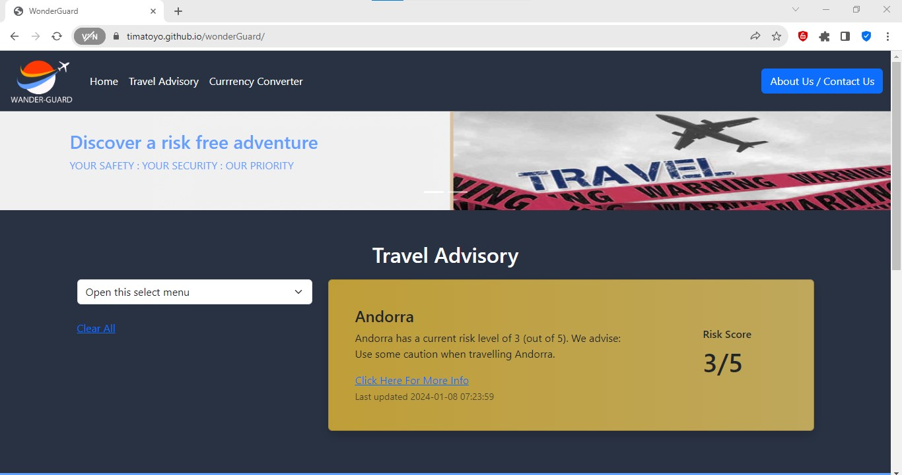
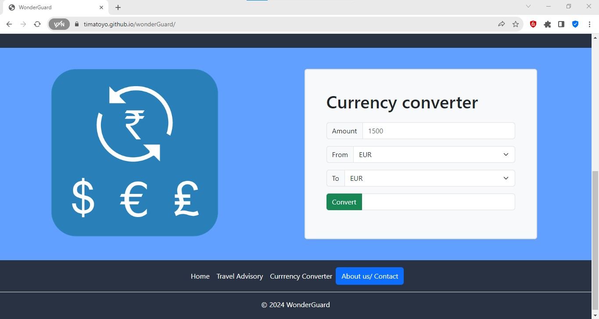
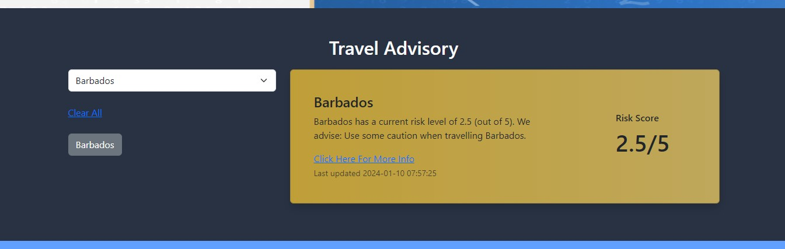
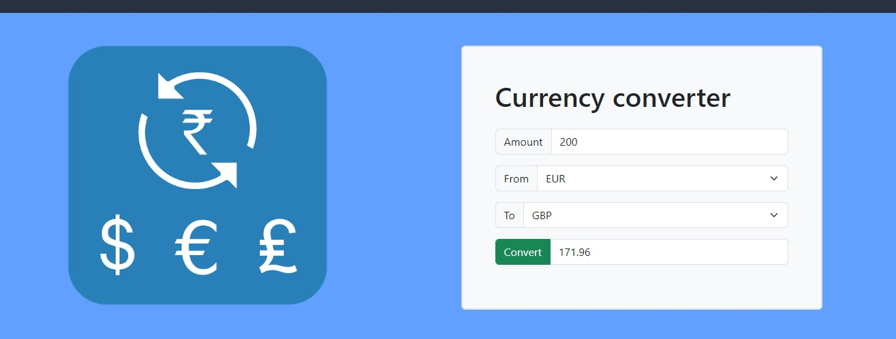
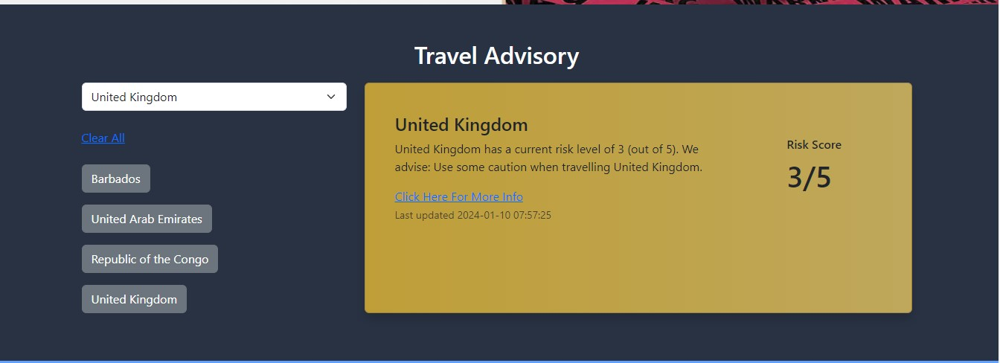

# WANDER-GUARD

<!-- Developer Signature and github details -->
 

  

<h3 align="center">Wander-Guard App</h3>
 
  
<h5 align="center">Your Ultimate Traveller's Companion App!  </h5> 
     
    <a href="https://github.com/TimAtoyo/wonderGuard"><strong>GitHub repository</strong></a>
     
    <a href="https://timatoyo.github.io/wonderGuard"><strong>Deployed Website</strong></a>
     
     
    
  

<!-- ABOUT THE PROJECT -->
## About The Project

In this project we created a seamless traveller's companion application that a user can use to navigate the world confidently with real-time information from top travel advisory APIs, ensuring a user stay informed and updated about safety and risk levels of any proposed travel destination. This app runs in the browser, and features dynamically updated HTML and CSS powered by JavaScript code. It has a clean and polished user interface that is responsive, ensuring that it adapts to multiple screen sizes. The shades of Blue and white combination makes the UI more appealing to users.

## App Display Pages
Below are the images of different sections and features of the webpage.

### Front Page (Header Section)

### Front Page (Footer Section)

### Travel Advisory Section

### Currency Converter Section

### When user chooses a country,the country is appended for future reference unless cleared by the user.

### When customer checks all checkboxes

## Mobile and tablet view images

### Mobile view

### Tablet view

### Built With

* HTML
* CSS
* Javascript
* Bootstrap
* APIs

<!-- LICENSE -->
## License

created under the STOZ INC. License. See `LICENSE.txt` for more information.

Project Link: [https://github.com/TimAtoyo/wonderGuard](https://github.com/TimAtoyo/wonderGuard)

Deployed Website: [https://timatoyo.github.io/wonderGuard/"](https://timatoyo.github.io/wonderGuard/)

## Helpful Resources
- [Google](https://www.google.com/)
- [Stackoverflow](https://stackoverflow.com/)

- [W3Schools](https://www.w3schools.com/js/DEFAULT.asp)

- [Github Pages Guide](https://pages.github.com/)

